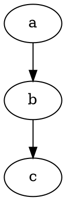

# Welcome to RAIMAD!

Start reading at [Installing RAIMAD](pages/install.md)
or [browse the map of all pages](map.md).
Are you a TIFUUN collaborator?
Visit the [TIFUUN collaborator welcome page](pages/tifuun.md)!


<nav id="navgrid">
    <a href="pages/tutorial.html">
        <i class="fa-solid fa-graduation-cap icon"></i>
        <h3>Tutorial</h3>
        Learn RAIMAD step-by-step
    </a>
    <!--<a href="map.html">
        
        <h3>Map</h3>
        Browse the map of all RAIDOC pages
    </a>-->
    <a href="pages/tifuun.html">
        
        <h3>TIFUUN</h3>
        Are you a TIFUUN collaborator?
        Read the welcome page!
    </a>
    <a href="pages/contributor-guide.html">
        <i class="fa-solid fa-code icon"></i>
        <h3>Contribute</h3>
        Want to contiribute to RAIMAD?
        Check the Controbutor's guide!
    </a>
</nav>

## Offline Access and Old Versions

Archives of the current and previous versions of this
documentation can be found on the
[Github releases page](https://github.com/tifuun/raidoc/releases).
After extracting the archive, open the contained `index.html`

{{all_pages}}

<!--




```
unidentified code
```

```python
import marko
marko.magic(1, 'string')
```

```python exec filename=wtf.py
import os

some_var = os.getcwd()
print(some_var)

```

```python exec filename="my_script.py"
print('hello world')
print(some_var)
```

```python exec
import pycif as pc

snowman = pc.Snowman()
show(snowman)

```

```python exec
exporter = pc.CIFExporter(snowman)
exporter.export_cif()
show(exporter.as_dot())
```
-->

