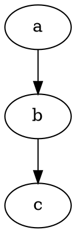

# Welcome to RAIMAD!

Creating components in RAIMAD is as simple as...

```python exec
import raimad as rai

class IShapedFilter(rai.Compo):
    def _make(self, beam_length: float = 10.5):
        beam = rai.RectWH(2, beam_length).proxy()
        coup_top = rai.RectWH(10, 2).proxy()
        coup_bot = rai.RectWH(12, 2).proxy()

        coup_top.snap_above(beam)
        coup_bot.snap_below(beam)

        self.subcompos.beam = beam
        self.subcompos.coup_top = coup_top
        self.subcompos.coup_bot = coup_bot

coup1 = IShapedFilter()
show(coup1)
```

Once you've made your basic components
(or, as we call them, "compos"),
you can put them together into larger compos:

```python exec
class Filterbank(rai.Compo):
    def _make(self):
        
        for index, length in enumerate((10.5, 11.7, 12.8)):
            filt = IShapedFilter(beam_length = length).proxy()
            filt.bbox.bot_mid.to((17 * index, 0))
            self.subcompos[f"filt_{index}"] = filt

        thz_line = rai.RectWire(
            self.subcompos.filt_0.bbox.bot_left,
            self.subcompos.filt_2.bbox.bot_right,
            thickness=2
            ).proxy()

        thz_line.move(0, -4)

        self.subcompos.thz_line = thz_line

bank = Filterbank()
show(bank)
```


See also [beta](beta.md)

See also [cif-export-deepdive](cif-export-deepdive.md)

<!--



```
unidentified code
```

```python
import marko
marko.magic(1, 'string')
```

```python exec filename=wtf.py
import os

some_var = os.getcwd()
print(some_var)

```

```python exec filename="my_script.py"
print('hello world')
print(some_var)
```

```python exec
import pycif as pc

snowman = pc.Snowman()
show(snowman)

```

```python exec
exporter = pc.CIFExporter(snowman)
exporter.export_cif()
show(exporter.as_dot())
```
-->

