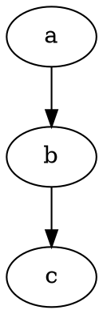

# Welcome to RAIMAD!

Start reading at [Installing RAIMAD](install.md)
or [browse the map of all pages](map.md).


<!--



```
unidentified code
```

```python
import marko
marko.magic(1, 'string')
```

```python exec filename=wtf.py
import os

some_var = os.getcwd()
print(some_var)

```

```python exec filename="my_script.py"
print('hello world')
print(some_var)
```

```python exec
import pycif as pc

snowman = pc.Snowman()
show(snowman)

```

```python exec
exporter = pc.CIFExporter(snowman)
exporter.export_cif()
show(exporter.as_dot())
```
-->

