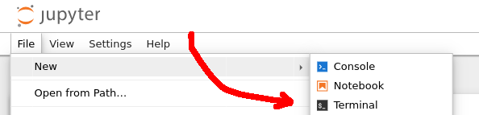

# Installing RAIMAD

RAIMAD is a Python package.
It is available under the name `raimad` (lowercase)
on [PyPI](https://pypi.org/project/raimad/).
You should install it like any other Python package.

- If you are using (ana)conda, follow the
[official documentation](https://docs.anaconda.com/free/working-with-conda/packages/install-packages/)
for installing packages.
- If you are using regular Python,
use pip to install raimad.
Simply run this command in a terminal:
`pip install raimad`

> [DANGER]
> If you're using a notebook environment like
> **Jupyter Notebook**, **JupyterLab**,
> or **Google Colab**,
> use a **terminal** to run pip,
> not a code cell.
>
> The button to open a terminal in Jupyter Lab / Notebook looks like this:
>
> 
>
> Google Colab requires a paid subscription to use the terminal.
> If you don't have a paid subscription,
> just run `!pip install raimad` in a code cell and hope that it works.
> 
> _The reason running `pip` inside a code cell is a bad idea is that
> if `pip` decides to ask you an interactive question,
> the notebook will hang forever.
> This happens because code cells are not real terminals,
> even though `pip` gets tricked into thinking that they are._

## Check the installation worked

RAIMAD ships with a sample Snowman component.
You can try exporting the snowman to CIF to check that
RAIMAD is installed correctly:

```python
import raimad as rai

rai.export_cif(rai.Snowman(), '/path/to/output/file.cif')
```

> [INFO]
> Windows paths in Python
>
> Backslashes are special characters in Python.
> If you want to write a Windows path in a Python string,
> you can either make the backslashes double
> or put the letter `r` immediately before the opening quote:
>
> - `rai.export_cif(rai.Snowman(), 'C:\\Users\\raima\\Documents\\snowman.cif')`
> - `rai.export_cif(rai.Snowman(), r'C:\Users\raima\Documents\snowman.cif')`

> [INFO]
> Relative Paths
>
> If you give a relative path (i.e. not starting with a drive letter
> or a (back)slash),
> the file will be created in the current working directory.
> This is usually the directory that contains the Python script or notebook.
> For example:
>
> `rai.export_cif(rai.Snowman(), 'snowman.cif')`

If all goes well, the output file should contain a snowman:

```python exec hide-code
import raimad as rai
show(rai.Snowman())
```

> [INFO]
> Don't know how to open CIF files?
> [KLayout](https://www.klayout.de/) is highly recommended.

Next up: [The Basics of RAIMAD](basics.md)

